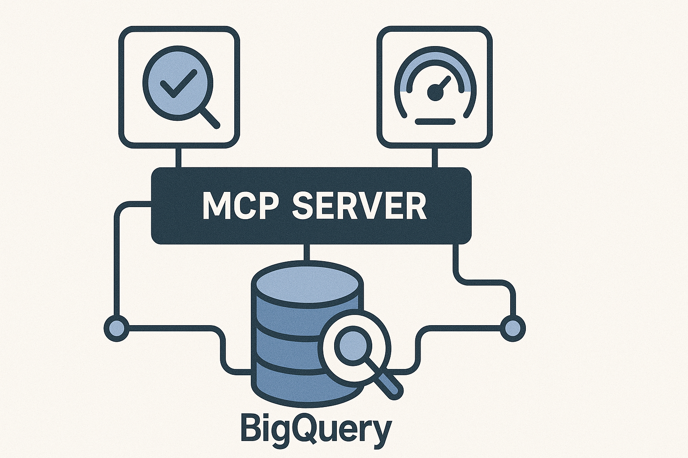

# mcp-bigquery

<div align="center">



**Safe BigQuery exploration through Model Context Protocol**

[](LICENSE)
[](https://pypi.org/project/mcp-bigquery/)
[](https://pypi.org/project/mcp-bigquery/)
[](https://pypi.org/project/mcp-bigquery/)

[**Documentation**](https://caron14.github.io/mcp-bigquery/) | 
[**Quick Start**](#-quick-start) | 
[**Tools**](#-available-tools) | 
[**Examples**](#-examples) | 
[**Troubleshooting**](#-troubleshooting)

</div>

---

## 🚀 What is MCP BigQuery?

**MCP BigQuery** is a Model Context Protocol (MCP) server that enables AI assistants like Claude to safely interact with Google BigQuery. It provides comprehensive SQL validation, cost analysis, and schema exploration capabilities **without ever executing queries**.

### 🛡️ Safety First Design

- **Zero Query Execution**: All operations are read-only or dry-run
- **No Data Modification**: Impossible to accidentally modify or delete data
- **Cost Transparency**: See estimated costs before running any query
- **AI-Friendly**: Designed specifically for safe AI assistant integration

### 💡 Why Use MCP BigQuery?

- **Cost Optimization**: Analyze query costs before execution
- **Schema Discovery**: Explore datasets and tables without writing SQL
- **Query Validation**: Catch errors before they cost you money
- **Performance Analysis**: Get optimization suggestions instantly
- **Safe Exploration**: Perfect for AI assistants and automation

## ✨ Features

### 📊 SQL Analysis & Validation
- ✅ **Syntax Validation** - Catch errors before execution
- 💰 **Cost Estimation** - Know costs upfront (USD estimates)
- 🔍 **Query Analysis** - Understand complexity and structure
- 🗺️ **Dependency Mapping** - Track table and column usage
- ⚡ **Performance Scoring** - Get optimization recommendations

### 🔎 Schema Discovery & Metadata
- 📁 **Dataset Explorer** - Browse all datasets in your project
- 📋 **Table Browser** - View tables with partitioning info
- 📝 **Schema Inspector** - Detailed field information
- 🔐 **Metadata Access** - Safe INFORMATION_SCHEMA queries
- 📈 **Statistics** - Table sizes, row counts, and more

## 🎯 Quick Start

### Prerequisites

- Python 3.10+
- Google Cloud Project with BigQuery API enabled
- Authentication configured (ADC or service account)

### Installation

```bash
# Install from PyPI
pip install mcp-bigquery

# Or with uv (recommended)
uv pip install mcp-bigquery
```

### 🔑 Authentication

```bash
# Option 1: Application Default Credentials (recommended)
gcloud auth application-default login

# Option 2: Service Account
export GOOGLE_APPLICATION_CREDENTIALS=/path/to/key.json
```

### ⚙️ Configuration

#### For Claude Desktop

Add to your Claude configuration file:
- macOS: `~/Library/Application Support/Claude/claude_desktop_config.json`
- Windows: `%APPDATA%\Claude\claude_desktop_config.json`

```json
{
  "mcpServers": {
    "mcp-bigquery": {
      "command": "mcp-bigquery",
      "env": {
        "BQ_PROJECT": "your-project-id",
        "BQ_LOCATION": "US"
      }
    }
  }
}
```

### 🚦 Quick Test

Once configured, ask Claude:
- "Can you validate this BigQuery SQL: SELECT * FROM dataset.table"
- "What datasets are available in my BigQuery project?"
- "Show me the schema for table X in dataset Y"

## 🛠️ Available Tools

### SQL Validation & Analysis

| Tool | Description | Use Case |
|------|-------------|----------|
| `bq_validate_sql` | Validate SQL syntax | Check query before execution |
| `bq_dry_run_sql` | Get cost estimates & metadata | Understand query cost and impact |
| `bq_analyze_query_structure` | Analyze query complexity | Review query patterns and optimization |
| `bq_extract_dependencies` | Extract table/column dependencies | Understand data lineage |
| `bq_validate_query_syntax` | Enhanced validation with suggestions | Get detailed error messages |

### Schema Discovery

| Tool | Description | Use Case |
|------|-------------|----------|
| `bq_list_datasets` | List all datasets | Explore available datasets |
| `bq_list_tables` | List tables in dataset | Browse table catalog |
| `bq_describe_table` | Get table schema | Understand table structure |
| `bq_get_table_info` | Comprehensive table metadata | Deep dive into table details |
| `bq_query_info_schema` | Query INFORMATION_SCHEMA | Advanced metadata queries |

### Performance Optimization

| Tool | Description | Use Case |
|------|-------------|----------|
| `bq_analyze_query_performance` | Performance analysis | Get optimization suggestions |

## 📚 Examples

### 🎯 Common Use Cases

#### 1. Cost Estimation Before Query Execution
```json
{
  "tool": "bq_dry_run_sql",
  "sql": "SELECT * FROM `bigquery-public-data.samples.shakespeare`"
}
// Returns: bytes processed, USD cost estimate, schema preview
```

#### 2. Validate Complex Query
```json
{
  "tool": "bq_validate_sql",
  "sql": "SELECT user_id, COUNT(*) FROM orders GROUP BY user_id",
  "params": {"start_date": "2024-01-01"}
}
// Returns: validation status and any errors
```

#### 3. Explore Dataset Schema
```json
{
  "tool": "bq_list_tables",
  "dataset_id": "my_dataset"
}
// Returns: all tables with metadata, partitioning, clustering info
```

#### 4. Analyze Query Performance
```json
{
  "tool": "bq_analyze_query_performance",
  "sql": "SELECT * FROM large_table WHERE date > '2024-01-01'"
}
// Returns: performance score, optimization suggestions
```

### 💡 Advanced Examples

#### Query Structure Analysis
```python
# Analyze a complex query with CTEs and window functions
result = bq_analyze_query_structure(
    sql="""
    WITH ranked_sales AS (
      SELECT 
        product_id,
        sale_amount,
        ROW_NUMBER() OVER (PARTITION BY category ORDER BY sale_amount DESC) as rank
      FROM sales
    )
    SELECT * FROM ranked_sales WHERE rank <= 10
    """
)
# Returns: complexity score, detected features (CTEs, window functions, etc.)
```

#### Dependency Extraction
```python
# Extract all table and column dependencies
result = bq_extract_dependencies(
    sql="SELECT u.name, o.total FROM users u JOIN orders o ON u.id = o.user_id"
)
# Returns: {'tables': ['users', 'orders'], 'columns': ['name', 'total', 'id', 'user_id']}
```

## 🏗️ Architecture

```
mcp-bigquery/
├── src/mcp_bigquery/
│   ├── server.py           # MCP server implementation
│   ├── bigquery_client.py  # BigQuery client management
│   ├── sql_analyzer.py     # SQL parsing and analysis
│   ├── schema_explorer.py  # Schema discovery tools
│   └── info_schema.py      # INFORMATION_SCHEMA queries
```

## ⚙️ Environment Variables

| Variable | Description | Default |
|----------|-------------|---------|
| `BQ_PROJECT` | GCP project ID | From ADC |
| `BQ_LOCATION` | BigQuery location | None |
| `SAFE_PRICE_PER_TIB` | Price per TiB (USD) | 5.0 |
| `DEBUG` | Enable debug logging | None |

## 🐛 Troubleshooting

### Common Issues

#### Authentication Errors
```bash
# Error: Could not automatically determine credentials
Solution: Run 'gcloud auth application-default login'
```

#### Permission Errors
```bash
# Error: User does not have bigquery.tables.get permission
Solution: Ensure your account has BigQuery Data Viewer role
```

#### Project Not Set
```bash
# Error: Project ID is required
Solution: Set BQ_PROJECT environment variable in config
```

### Debug Mode

Enable debug logging for troubleshooting:
```json
{
  "env": {
    "DEBUG": "true",
    "BQ_PROJECT": "your-project"
  }
}
```

## 🎯 Best Practices

1. **Always Validate First**: Use `bq_validate_sql` before `bq_dry_run_sql`
2. **Check Costs**: Review cost estimates before actual execution
3. **Use Parameters**: Leverage parameterized queries for safety
4. **Explore Schemas**: Use schema tools before writing complex queries
5. **Monitor Performance**: Regular performance analysis saves money

## 🧪 Testing

```bash
# Install development dependencies
pip install -e ".[dev]"

# Run all tests
pytest tests/

# Run with coverage
pytest --cov=mcp_bigquery tests/

# Run specific test file
pytest tests/test_features.py -v
```

## 📈 Development

### Local Development
```bash
# Clone repository
git clone https://github.com/caron14/mcp-bigquery.git
cd mcp-bigquery

# Install in development mode
pip install -e ".[dev]"

# Run locally
python -m mcp_bigquery
```

### Contributing

We welcome contributions! Please see our [Contributing Guide](CONTRIBUTING.md) for details.

## 🔒 Security

- **No Query Execution**: All operations are dry-run only
- **No Write Operations**: Cannot modify data or schema
- **Credential Safety**: Uses Google's standard authentication
- **Parameter Sanitization**: SQL parameters are properly escaped

## 📝 Limitations

- **Dry-Run Only**: Cannot execute actual queries
- **Cost Estimates**: Approximations based on bytes processed
- **Parameter Types**: All parameters treated as STRING type
- **Cache Disabled**: Always returns fresh estimates

## 📚 Documentation

Full documentation available at [https://caron14.github.io/mcp-bigquery/](https://caron14.github.io/mcp-bigquery/)

- [Getting Started Guide](https://caron14.github.io/mcp-bigquery/getting-started/)
- [API Reference](https://caron14.github.io/mcp-bigquery/api/)
- [Examples](https://caron14.github.io/mcp-bigquery/examples/)
- [Troubleshooting](https://caron14.github.io/mcp-bigquery/troubleshooting/)

## 🗺️ Roadmap

See our [Development Roadmap](ROADMAP.md) for upcoming features:
- v0.5.0: Advanced metadata analysis and query optimization
- v0.6.0: Query history analysis and cost forecasting

## 📄 License

MIT License - see [LICENSE](LICENSE) file for details.

## 🙏 Acknowledgments

- Google BigQuery team for the excellent API
- Anthropic for the MCP protocol
- All contributors and users

## 📊 Changelog

### [0.4.1] - 2025-01-22
- Enhanced error handling and input validation
- Added debug logging support
- Improved test reliability
- Better error messages with troubleshooting guidance

### [0.4.0] - 2025-01-22
- Added 6 new schema discovery tools
- INFORMATION_SCHEMA query support
- Performance analysis and optimization suggestions
- Comprehensive table metadata access

### [0.3.0] - 2025-01-17
- SQL structure analysis and complexity scoring
- Dependency extraction and mapping
- Enhanced syntax validation

[Full Changelog](https://github.com/caron14/mcp-bigquery/releases)

---

<div align="center">

**Built with ❤️ for safe BigQuery exploration**

[Report Bug](https://github.com/caron14/mcp-bigquery/issues) · 
[Request Feature](https://github.com/caron14/mcp-bigquery/issues) · 
[Documentation](https://caron14.github.io/mcp-bigquery/)

</div>