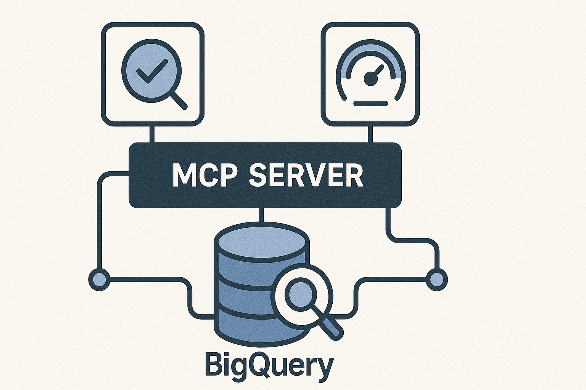

# mcp-bigquery

<div align="center">



**Safe BigQuery exploration through Model Context Protocol**

[](LICENSE)
[](https://pypi.org/project/mcp-bigquery/)
[](https://pypi.org/project/mcp-bigquery/)
[](https://pypi.org/project/mcp-bigquery/)

[**Documentation**](https://caron14.github.io/mcp-bigquery/) | 
[**Quick Start**](#-quick-start) | 
[**Examples**](#-examples-of-usage)

</div>

---

## Overview

mcp-bigquery is a Model Context Protocol (MCP) server that enables AI assistants (such as Claude) to interact securely with Google BigQuery.

### Key Features

* **Secure execution**: All operations are strictly limited to dry-run verification. The server never executes queries that mutate data or incur execution costs.
* **Cost transparency**: Provides estimates of query costs and processed bytes before execution.
* **Static analysis**: Analyzes query dependencies and validates SQL syntax.
* **Schema exploration**: Browses datasets, tables, and columns.

### Business Value

| Problem | Solution with mcp-bigquery |
|---------|---------------------------|
| Unintentional execution of costly queries | Pre-execution cost estimation |
| Delayed development due to SQL syntax errors | Early syntax error detection |
| Lack of visibility into schema structures | Secure schema metadata discovery |
| Risk of unauthorized data mutation by AI | Enforced dry-run constraints |

---

## Quick Start

### Step 1: Installation

Install the package via pip:

```bash
pip install mcp-bigquery
```

### Step 2: Authentication

Set up Google Cloud Platform authentication:

```bash
# For user account authentication
gcloud auth application-default login

# For service account authentication
export GOOGLE_APPLICATION_CREDENTIALS=/path/to/key.json
```

### Step 3: Claude Desktop Configuration

Configure the server in the Claude Desktop configuration file:
* **macOS**: `~/Library/Application Support/Claude/claude_desktop_config.json`
* **Windows**: `%APPDATA%\Claude\claude_desktop_config.json`

Add the following entry:

```json
{
  "mcpServers": {
    "mcp-bigquery": {
      "command": "mcp-bigquery",
      "env": {
        "BQ_PROJECT": "your-gcp-project-id"
      }
    }
  }
}
```

### Step 4: Verification

Restart Claude Desktop and run the following queries to verify the setup:

* "What datasets are available in my BigQuery project?"
* "Can you estimate the cost of: SELECT * FROM dataset.table"
* "Show me the schema for the users table"

---

## Available Tools

### SQL Validation and Analysis

| Tool | Purpose | Primary Use Case |
|------|---------|------------------|
| **bq_validate_sql** | Check SQL syntax | Verification prior to query execution |
| **bq_dry_run_sql** | Retrieve cost estimates and metadata | Pre-execution cost assessment |
| **bq_extract_dependencies** | Map table dependencies | Lineage and dependency mapping |
| **bq_validate_query_syntax** | Detailed syntax analysis | Debugging complex SQL queries |

### Schema Discovery

| Tool | Purpose | Primary Use Case |
|------|---------|------------------|
| **bq_list_datasets** | List all datasets in the project | Initial project discovery |
| **bq_list_tables** | List tables with partitioning metadata | Dataset structure browsing |
| **bq_describe_table** | Get detailed schema details | Column-level verification |
| **bq_get_table_info** | Retrieve comprehensive metadata | Table statistics analysis |
| **bq_preview_table** | Preview table data (cost-free) | Checking sample records without data scan costs |

> [!IMPORTANT]
> The **bq_preview_table** tool uses `client.list_rows` (API: `tabledata.list`) to retrieve sample rows directly, resulting in zero bytes scanned and no execution costs. To prevent unintended exposure of sensitive information (such as PII) to the LLM, this tool is disabled by default. You must explicitly opt in by setting `MCP_BQ_ENABLE_PREVIEW=true` in your environment config.

---

## Configuration

### Environment Variables

| Variable | Purpose | Default |
|----------|---------|---------|
| `BQ_PROJECT` | Target GCP Project ID | Determined via ADC |
| `BQ_LOCATION` | Target BigQuery Region | Not set |
| `SAFE_PRICE_PER_TIB` | Price per TiB for cost estimation | 5.0 |
| `LOG_LEVEL` | Logging verbosity (DEBUG, INFO, WARNING, ERROR, CRITICAL) | WARNING |
| `MCP_BQ_ENABLE_PREVIEW` | Enable the bq_preview_table tool (true/false) | false |

### Example .env File

For local testing or development environments, you can define these variables in a `.env` file:

```env
BQ_PROJECT=your-gcp-project-id
BQ_LOCATION=asia-northeast1
SAFE_PRICE_PER_TIB=5.0
LOG_LEVEL=WARNING
MCP_BQ_ENABLE_PREVIEW=true
```

### Complete Claude Desktop Configuration Example

```json
{
  "mcpServers": {
    "mcp-bigquery": {
      "command": "mcp-bigquery",
      "env": {
        "BQ_PROJECT": "my-production-project",
        "BQ_LOCATION": "asia-northeast1",
        "SAFE_PRICE_PER_TIB": "6.0",
        "LOG_LEVEL": "WARNING",
        "MCP_BQ_ENABLE_PREVIEW": "true"
      }
    }
  }
}
```

---

## Troubleshooting

### Mapped Errors and Solutions

#### Authentication Error
```
Error: Could not automatically determine credentials
```
* **Solution**: Re-authenticate using the command line:
  ```bash
  gcloud auth application-default login
  ```

#### Permission Denied
```
Error: User does not have bigquery.tables.get permission
```
* **Solution**: Grant the `BigQuery Data Viewer` role to the target identity:
  ```bash
  gcloud projects add-iam-policy-binding YOUR_PROJECT \
    --member="user:your-email@example.com" \
    --role="roles/bigquery.dataViewer"
  ```

#### Project ID Missing
```
Error: Project ID is required
```
* **Solution**: Ensure the `BQ_PROJECT` variable is set correctly in your configuration.

---

## Examples of Usage

### Example 1: Check Costs Before Running

```python
# Before running an expensive query...
query = "SELECT * FROM `bigquery-public-data.github_repos.commits`"

# First, check the cost
result = bq_dry_run_sql(sql=query)
print(f"Estimated cost: ${result['usdEstimate']}")
print(f"Data processed: {result['totalBytesProcessed'] / 1e9:.2f} GB")

# Output:
# Estimated cost: $12.50
# Data processed: 2500.00 GB
```

### Example 2: Understand Table Structure

```python
# Check table schema
result = bq_describe_table(
    dataset_id="your_dataset",
    table_id="users"
)

# Output:
# ├── user_id (INTEGER, REQUIRED)
# ├── email (STRING, NULLABLE)
# ├── created_at (TIMESTAMP, REQUIRED)
# └── profile (RECORD, REPEATED)
#     ├── name (STRING)
#     └── age (INTEGER)
```

### Example 3: Track Data Dependencies

```python
# Understand query dependencies
query = """
WITH user_stats AS (
  SELECT user_id, COUNT(*) as order_count
  FROM orders
  GROUP BY user_id
)
SELECT u.name, s.order_count
FROM users u
JOIN user_stats s ON u.id = s.user_id
"""

result = bq_extract_dependencies(sql=query)

# Output:
# Tables: ['orders', 'users']
# Columns: ['user_id', 'name', 'id']
# Dependency Graph:
#   orders → user_stats → final_result
#   users → final_result
```

---

## Project Status and Version History

| Version | Release Date | Summary of Changes |
|---------|--------------|--------------------|
| v0.7.0 | 2026-06-21 | Added cost-free table preview tool (`bq_preview_table`) and security opt-in configuration |
| v0.6.0 | 2026-06-21 | Thread-safe caching, recursive AST queries, backoff retries, and Google API exception mapping |
| v0.5.0 | 2026-01-02 | Consolidated formatters, client cache, and unified logging controls |
| v0.4.2 | 2025-12-08 | Modular schema explorer and unified client/logging controls |
| v0.4.1 | 2025-01-22 | Error handling and debug logging improvements |
| v0.4.0 | 2025-01-22 | Added schema discovery tools |
| v0.3.0 | 2025-01-17 | Integrated SQL static analysis engine |
| v0.2.0 | 2025-01-16 | Initial release supporting basic validation and dry-run queries |

---

## Development and Contribution

For instructions on local development setup and contribution policies, please refer to the [CONTRIBUTING.md](CONTRIBUTING.md) guide.

```bash
# Clone the repository
git clone https://github.com/caron14/mcp-bigquery.git
cd mcp-bigquery

# Install development dependencies
pip install -e ".[dev]"

# Execute the test suite
pytest tests/
```

---

## License

This project is licensed under the MIT License. See [LICENSE](LICENSE) for details.
